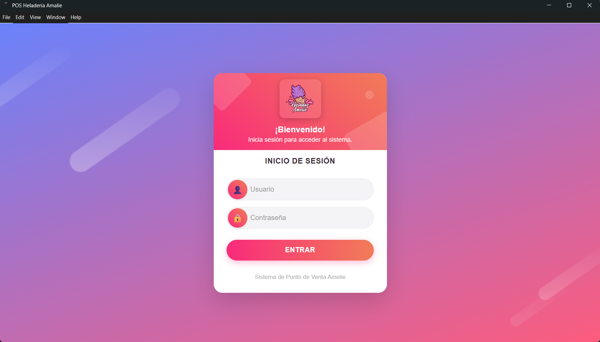

# POS Heladeria Amelie 🍦🖥️

Sistema Punto de Venta de escritorio para la gestión integral de una heladería, permitiendo administrar productos, categorías, sabores, ventas y usuarios de manera rápida y eficiente.



## ✍️ Características

- Gestión completa de productos (crear, editar, eliminar, listar)
- Gestión de categorías (crear, editar, eliminar, listar)
- Gestión de empleados (crear, editar, eliminar, listar)
- Informacion sobre ventas
- Interfaz atractiva y responsiva con animaciones
- Aplicación de escritorio usando Electron
- Backend seguro con Node.js + Express
- Base de datos SQlite
- Autenticación mediante JWT
- Integración de frontend React + Vite

## 👨‍💻 Tecnologías utilizadas

- React JS
- Vite
- Sqlite
- CSS
- Node.js + Express (Backend)
- Electron

[](https://skillicons.dev)

<details><summary><b>Estructura del proyecto</b></summary>
pos-heladeria-amalie/
├── .github/
│   ├── readme_assets/
│   │   └── heladeria_amelie.png
├── assets/
│   ├── logo_amelie.ico
│   └── images/
├── backend/
│   ├── images/
│   │   └── sabores/
│   ├── src/
│   │   ├── database/
│   │   │   ├── connection.js
│   │   │   ├── createDB.js
│   │   │   └── seedData.js
│   │   ├── middlewares/
│   │   │   └── auth.middleware.js
│   │   └── modules/
│   │       ├── categories/
│   │       ├── categories-flavours/
│   │       ├── employees/
│   │       ├── flavours/
│   │       ├── products/
│   │       ├── reports/
│   │       └── sales/
│   ├── package.json
│   ├── .env
│   ├── database.db
│   ├── .gitignore
│   ├── package-lock.json
│   └── index.js
├── electron/
│   ├── main.js
│   └── preload.js
├── frontend/
│   ├── public/
│   ├── src/
│   │   ├── assets/
│   │   ├── components/
│   │   │   ├── auth/
│   │   │   ├── dashboard/
│   │   │   ├── orders/
│   │   │   ├── products/
│   │   │   ├── sales/
│   │   │   └── shared/
│   │   ├── config/
│   │   ├── context/
│   │   ├── hooks/
│   │   ├── pages/
│   │   ├── services/
│   │   ├── utils/
│   │   ├── App.css
│   │   ├── App.jsx
│   │   └── main.jsx
│   ├── .gitignore
│   ├── eslint.config.js
│   ├── index.html
│   ├── package.json
│   ├── package-lock.json
│   ├── README.md
│   └── vite.config.js
├── .npmrc
├── .gitignore
├── package-lock.json
├── package.json
└── README.md

</details>

## 🧰 Get Started

Para poner este proyecto en funcionamiento en su entorno de desarrollo, siga estas instrucciones paso a paso.

### ⚙️ Instalación & Correrlo en Local

**Step 0:**

Note :bangbang: **Backend:** La aplicación utiliza autenticación con JWT. Por lo que se deben declarar las siguientes variables de entorno:
`JWT_SECRET`, `JWT_EXPIRES` y `SALT_ROUNDS` en el archivo `.env`.

Note :bangbang: **Backend:** En la web API se usa nodemailer. Por lo que se deben declarar las siguientes variables de entorno
`MAIL_USER` y `MAIL_PASSWORD` en el archivo `.env`.

**Step 1:**

Descargue o clone este repositorio utilizando el siguiente enlace:

```bash
git clone https://github.com/LFernando07/pos-heladeria-amalie.git
cd pos-heladeria-amalie
```

**Step 2:**

Ir al backend
Ejecute el siguiente comando en el directorio para instalar las dependencias:

```bash
cd backend
npm install
```

**Step 3:**

Ejecute el siguiente comando para ejecutar el servidor de desarrollo localmente:
El backend se ejecutará normalmente en [http://localhost:5000](http://localhost:5000).

```bash
npm run dev
```

**Step 4:**

Ir al frontend
Ejecute el siguiente comando en el directorio para instalar las dependencias:

```bash
cd frontend
npm install
```

**Step 5:**

Ejecute el siguiente comando para ejecutar el frontend en el navegador:
El frontend se ejecutará en [http://localhost:5173](http://localhost:5173).

```bash
npm run dev
```

**Step 6:**

Volver a la raiz del proyecto
Ejecute el siguiente comando en el directorio para instalar las dependencias para electron:

```bash
npm install
```

**Step 7:**

Ejecute el siguiente comando para ejecutar la aplicacion de escritorio en en modo desarrollo:

```bash
npm run dev
```

## 🚀 Producción / Build

**Step 1:**

Ejecute el siguiente comando para construir el frontend

```bash
npm run build
```

**Step 2:**

Ejecute el siguiente comando para empaquetar aplicación de escritorio

```bash
npm run make
```

## 📋 Licencia

**Translate-Google-Clone-AI** es software de código abierto
— Ver [licensed as MIT](https://opensource.org/license/mit/) y es de uso gratuito
